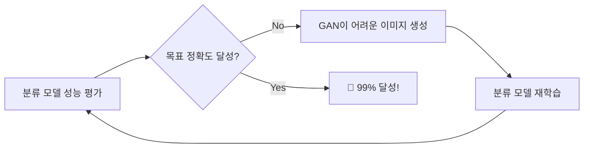

질문: 내가 지금까지 이야기한 내용을 니가 이해한만큼 필요한 이론과 라이브러리 그리고 어떻게 구현할지를 흐름순으로 기술해 볼래?


# 🚀 Adaptive Cyclic GAN System for Document Image Classification

> **목표**: 이미지 문서 분류 모델이 99% 정확도에 도달할 때까지 GAN과 분류기가 순환적으로 경쟁하며 성능을 향상시키는 시스템

## 📋 Table of Contents

- [🎯 시스템 개요](#-%EC%8B%9C%EC%8A%A4%ED%85%9C-%EA%B0%9C%EC%9A%94)
- [📚 필요한 이론적 배경](#-%ED%95%84%EC%9A%94%ED%95%9C-%EC%9D%B4%EB%A1%A0%EC%A0%81-%EB%B0%B0%EA%B2%BD)
- [🛠️ 필요한 라이브러리 및 도구](#%EF%B8%8F-%ED%95%84%EC%9A%94%ED%95%9C-%EB%9D%BC%EC%9D%B4%EB%B8%8C%EB%9F%AC%EB%A6%AC-%EB%B0%8F-%EB%8F%84%EA%B5%AC)
- [⚡ 시스템 구현 흐름](#-%EC%8B%9C%EC%8A%A4%ED%85%9C-%EA%B5%AC%ED%98%84-%ED%9D%90%EB%A6%84)
- [🔧 핵심 구현 포인트](#-%ED%95%B5%EC%8B%AC-%EA%B5%AC%ED%98%84-%ED%8F%AC%EC%9D%B8%ED%8A%B8)
- [📊 성능 모니터링](#-%EC%84%B1%EB%8A%A5-%EB%AA%A8%EB%8B%88%ED%84%B0%EB%A7%81)


## 🎯 시스템 개요

### 💡 핵심 아이디어



**적응형 순환 프로세스**:

1. 📈 분류 모델 성능이 목표치에 근접
2. 🤖 GAN이 더 어려운 이미지 생성
3. 🔄 분류 모델이 재학습하여 성능 향상
4. 🔁 목표 달성까지 반복

## 📚 필요한 이론적 배경

### 🎮 GAN 이론

- **🎯 미니맥스 게임 이론**: 생성자와 판별자의 적대적 학습
- **⚖️ Nash 균형**: 두 모델이 더 이상 개선될 수 없는 상태
- **🔄 적응형 증강**: StyleGAN2-ADA의 동적 조절 메커니즘


### 👁️ Vision Transformer 이론

- **🧠 Self-attention 메커니즘**: 전역적 컨텍스트 이해
- **🧩 패치 기반 처리**: 이미지를 패치로 나누어 처리
- **🔗 전이 학습**: 사전 훈련된 모델의 활용


### 🛡️ 적대적 훈련 이론

- **💪 Adversarial Training**: 모델의 견고성을 높이는 훈련 방법
- **🎯 Hard Sample Mining**: 어려운 샘플을 우선적으로 학습


## 🛠️ 필요한 라이브러리 및 도구

### 🔥 딥러닝 프레임워크

```python
import torch
import torch.nn as nn
import torch.optim as optim
from torch.utils.data import DataLoader, Dataset
import torchvision.transforms as transforms
```


### 👁️ Vision Transformer

```python
from transformers import ViTImageProcessor, ViTForImageClassification
from transformers import TrOCRProcessor, VisionEncoderDecoderModel
```


### 🤖 GAN 구현

```python
import torch.nn.functional as F
from torchvision.models import inception_v3  # FID 계산용
```


### 📊 데이터 처리 및 시각화

```python
import pandas as pd
import numpy as np
import matplotlib.pyplot as plt
from PIL import Image
import cv2
```


### 📈 모델 평가 및 모니터링

```python
from sklearn.metrics import accuracy_score, classification_report
import tensorboard
from torch.utils.tensorboard import SummaryWriter
```


## ⚡ 시스템 구현 흐름

### 🏗️ Phase 1: 기본 모델 구축

```python
# 📄 문서 이미지 분류 모델 초기화
class DocumentClassifier(nn.Module):
    def __init__(self, num_classes):
        super().__init__()
        self.vit = ViTForImageClassification.from_pretrained(
            'google/vit-base-patch16-224',
            num_labels=num_classes
        )
    
    def forward(self, x):
        return self.vit(x)

# 🎯 기본 성능 확보 (90% 이상)
classifier = DocumentClassifier(num_classes=10)
initial_accuracy = train_baseline_model(classifier, train_data)
```


### 🤖 Phase 2: GAN 모델 구축

```python
# 📄 문서 이미지 생성을 위한 GAN
class DocumentGAN(nn.Module):
    def __init__(self):
        super().__init__()
        self.generator = Generator(latent_dim=100, img_size=224)
        self.discriminator = Discriminator(img_size=224)
        self.difficulty_factor = 1.0  # 🎚️ 난이도 조절 인자
    
    def generate_hard_samples(self, classifier, num_samples=1000):
        """🎯 분류기가 어려워하는 샘플 생성"""
        with torch.no_grad():
            z = torch.randn(num_samples, 100)
            fake_images = self.generator(z)
            
            # 📊 분류기 신뢰도가 낮은 샘플 선별
            predictions = classifier(fake_images)
            confidence = F.softmax(predictions, dim=1).max(dim=1)[0]
            hard_indices = confidence < 0.8  # 신뢰도 80% 미만
            
            return fake_images[hard_indices]
```


### 🔄 Phase 3: 적응형 순환 시스템

```python
class AdaptiveCyclicSystem:
    def __init__(self, classifier, gan, target_accuracy=0.99):
        self.classifier = classifier
        self.gan = gan
        self.target_accuracy = target_accuracy  # 🎯 목표 정확도
        self.current_accuracy = 0.0
        self.cycle_count = 0
        
    def train_cycle(self, original_data, test_data):
        """🔄 적응형 순환 훈련 실행"""
        while self.current_accuracy < self.target_accuracy:
            print(f"🔄 Cycle {self.cycle_count}: Current accuracy = {self.current_accuracy:.4f}")
            
            # 1️⃣ 현재 성능 평가
            self.current_accuracy = self.evaluate_classifier(test_data)
            
            if self.current_accuracy >= self.target_accuracy:
                print(f"🎉 Target accuracy {self.target_accuracy} achieved!")
                break
            
            # 2️⃣ GAN으로 어려운 샘플 생성
            hard_samples = self.gan.generate_hard_samples(
                self.classifier, 
                num_samples=int(len(original_data) * 0.3)
            )
            
            # 3️⃣ 데이터 혼합 (원본 70% + GAN 30%)
            mixed_data = self.mix_datasets(original_data, hard_samples, ratio=0.3)
            
            # 4️⃣ 분류기 재훈련
            self.train_classifier(mixed_data)
            
            # 5️⃣ GAN 업데이트 (분류기 피드백 기반)
            self.update_gan_difficulty()
            
            self.cycle_count += 1
            
            # ⚠️ 무한 루프 방지
            if self.cycle_count > 50:
                print("⏰ Maximum cycles reached")
                break
    
    def update_gan_difficulty(self):
        """🎚️ 목표 정확도와의 차이에 따라 GAN 난이도 조절"""
        accuracy_gap = self.target_accuracy - self.current_accuracy
        
        if accuracy_gap > 0.05:  # 5% 이상 차이
            # 📈 더 어려운 샘플 생성하도록 GAN 조정
            self.gan.difficulty_factor = min(self.gan.difficulty_factor * 1.1, 2.0)
        else:
            # 🔧 난이도 미세 조정
            self.gan.difficulty_factor = max(self.gan.difficulty_factor * 0.95, 0.5)
```


### 📊 Phase 4: 성능 모니터링 및 제어

```python
class PerformanceMonitor:
    def __init__(self):
        self.writer = SummaryWriter('runs/adaptive_cyclic_training')
        self.accuracy_history = []
        self.loss_history = []
    
    def log_cycle_metrics(self, cycle, accuracy, loss, gan_quality):
        """📈 사이클별 성능 지표 로깅"""
        self.writer.add_scalar('Accuracy/Cycle', accuracy, cycle)
        self.writer.add_scalar('Loss/Cycle', loss, cycle)
        self.writer.add_scalar('GAN_Quality/FID', gan_quality, cycle)
        
        self.accuracy_history.append(accuracy)
        self.loss_history.append(loss)
    
    def check_convergence(self, window=5):
        """🎯 수렴 여부 확인"""
        if len(self.accuracy_history) < window:
            return False
        
        recent_accuracies = self.accuracy_history[-window:]
        variance = np.var(recent_accuracies)
        
        # 📊 분산이 작으면 수렴했다고 판단
        return variance < 0.0001
```


### 🔗 Phase 5: 전체 시스템 통합

```python
def main():
    """🚀 메인 실행 함수"""
    # 1️⃣ 데이터 로드
    train_data, test_data = load_document_datasets()
    
    # 2️⃣ 모델 초기화
    classifier = DocumentClassifier(num_classes=10)
    gan = DocumentGAN()
    
    # 3️⃣ 적응형 순환 시스템 생성
    adaptive_system = AdaptiveCyclicSystem(
        classifier=classifier,
        gan=gan,
        target_accuracy=0.99  # 🎯 99% 목표
    )
    
    # 4️⃣ 성능 모니터링 설정
    monitor = PerformanceMonitor()
    
    # 5️⃣ 순환 훈련 실행
    adaptive_system.train_cycle(train_data, test_data)
    
    # 6️⃣ 최종 결과 저장
    torch.save(classifier.state_dict(), 'final_classifier_99percent.pth')
    torch.save(gan.state_dict(), 'adaptive_gan.pth')
    
    print("✅ Training completed successfully!")

if __name__ == "__main__":
    main()
```


## 🔧 핵심 구현 포인트

### 🎚️ 동적 난이도 조절

- 📊 분류기 성능에 따라 GAN의 생성 난이도를 실시간 조절
- 🎯 목표 정확도와의 차이를 기반으로 한 적응형 제어


### ✅ 품질 보장 메커니즘

- 📏 **FID(Fréchet Inception Distance)**: GAN 생성 이미지 품질 평가
- 🔍 **판별자 점수**: 현실적인 이미지 필터링


### 🏁 수렴 조건

- 🎯 목표 정확도 달성 시 자동 종료
- ⏰ 성능 정체 시 조기 종료 메커니즘


## 📊 성능 모니터링

### 📈 주요 지표

| 지표 | 설명 | 목표값 |
| :-- | :-- | :-- |
| **정확도** | 분류 모델의 정확도 | 99% |
| **FID 점수** | GAN 생성 이미지 품질 | < 50 |
| **수렴 분산** | 최근 5 사이클 정확도 분산 | < 0.0001 |

### 🎯 예상 성능 향상 경로

```
초기 성능: 90% → 순환 1: 92% → 순환 2: 94% → ... → 목표: 99%
```


## 🎉 결론

이 시스템은 **GAN의 원래 설계 목적인 적대적 학습을 문서 분류 성능 향상에 특화**시킨 혁신적인 접근법으로, **99% 정확도**라는 높은 목표를 달성할 수 있는 실현 가능한 방법입니다.

### ✨ 주요 장점

- 🔄 **자동화된 성능 향상**: 인간 개입 없이 자동으로 성능 개선
- 🎯 **목표 지향적**: 명확한 정확도 목표 설정
- 🛡️ **견고성 향상**: 어려운 샘플로 훈련하여 모델 강화
- 📊 **실시간 모니터링**: 훈련 과정 전체를 실시간으로 추적

> 💡 **Note**: 이 시스템은 충분한 컴퓨팅 자원과 고품질 초기 데이터셋이 필요합니다.

